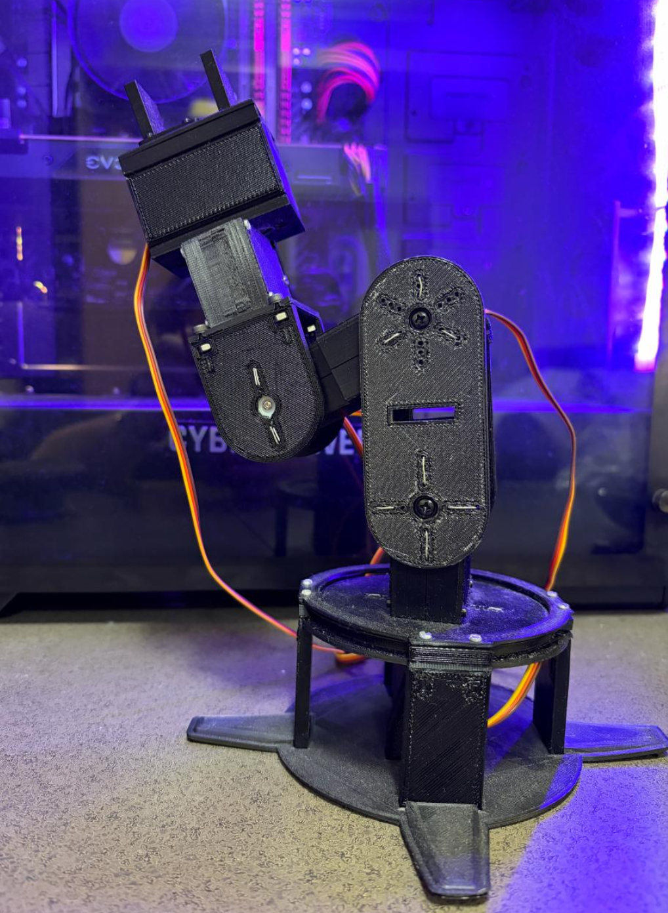
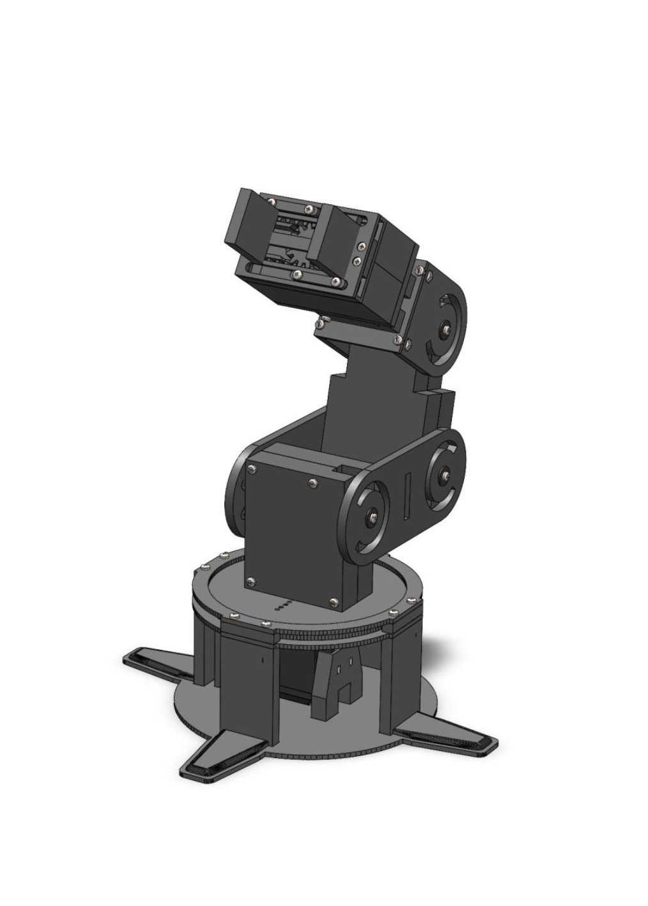

# 🖐️ 3D-Printed Robotic Arm

This project features a **custom 6-DOF 3D-printed robotic arm** designed for learning ROS and testing robotics algorithms. The arm is fully assembled and keyboard-controlled, with forward and inverse kinematics **calculated and planned for future implementation** to enable autonomous motion.

## Key Aspects

### Design & Fabrication: 

The robotic arm is built entirely from 3D-printed components, allowing for a lightweight and modular construction. This approach makes the design **customizable and easy to iterate**, enabling quick modifications to joint structures, link lengths, or end-effectors. The printed parts are robust enough for repeated use while remaining easy to assemble and maintain, providing a hands-on platform for learning and testing robotics concepts.

### Kinematics
The arm’s forward and inverse kinematics have been modeled to determine precise end-effector locations. Implementation for autonomous operation is in progress, enabling future autonomous motion experiments.

### Applications
Ideal for **learning robotics concepts**, experimenting with motion planning, integrating sensors, and developing ROS-based control systems for autonomous or semi-autonomous operation.
